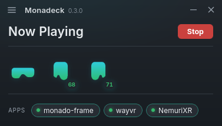

<div align="center">

# 🎮 Monadeck

**A SteamVR-style XR orchestrator & game launcher for Monado on Linux**

Built for a custom **Monado** fork and an **xrizer**-only workflow, where Envision's design didn't fit.



> **AI usage:** This project was developed with AI assistance (Anthropic's Claude), under human direction, testing, and review.

</div>

## What it does

Monadeck is two halves that share one library: an **in-headset launcher** you live in while you're in VR, and a small **desktop control panel** that looks after your Monado runtime.

### In the headset

- **🎮 Your whole library, curved around you**: Steam games and non-Steam shortcuts together on a SteamVR-style dashboard, with cover art, hero banners, and logos pulled from your Steam artwork.
- **▶️ Launch and stop without leaving VR**: start a game from the dashboard; an active-game card shows what's running, with the cover, a Stop button, and how long the current session has gone.
- **🔍 Find things fast**: search with an on-screen keyboard, **⭐ favourite** the ones you reach for, and sort any list by *recent · name · playtime · size*.
- **🗂️ Your own collections**: group games into named collections (*Seated*, *Standing*, whatever) and browse them as their own shelves.
- **⏱️ A timer that finds you anywhere**: set a countdown from the Tools tab; when it's up it rings a chime and drops an in-headset notification, even over a running game. Low-battery warnings work the same way.
- **🛋️ Comfortable placement**: move the dashboard closer or further, resize it, flatten the curve, tilt it to match where you're looking, or just grab it and put it where you want.
- **🔋 At-a-glance status**: a bottom bar with the time and live controller/tracker batteries.

### On the desktop

- **🚀 Run your Monado service**: start and stop it with your own environment variables.
- **🎛️ Switch runtimes safely**: register **xrizer** as the OpenVR runtime and point OpenXR at Monado, backing up and restoring your existing config so it never eats a working SteamVR setup.
- **⚡ One-click `CAP_SYS_NICE`**: the permission Monado wants after a rebuild, applied with a single authorised click.
- **🎮 Manage your games**: per-game launch options and **xrizer controller-binding overrides**.
- **🧩 Plugins by explicit path**: no `$PATH`, no `.desktop` files.
- **🔌 Live device list**: HMD, controllers, trackers, and battery via libmonado.

It deliberately **doesn't** build Monado from source, manage drivers, or check dependencies, that's what [Envision](https://gitlab.com/gabmus/envision) is for.

## How it works

Two parts, one configuration:

- **Desktop app**: where you set up the runtime, manage your games, artwork, bindings, and launch options. It sits in a normal window with custom chrome.
- **In-headset overlay**: an OpenXR dashboard the desktop app launches for you when VR starts. The overlay is bundled inside the desktop app, so there's nothing extra to install.

## Requirements

- **Linux** with a **Monado**-based OpenXR runtime (a custom build / fork is the whole point).
- **xrizer** as your OpenVR runtime, for SteamVR games.
- **Steam** (with **Proton** for Windows games), which Monadeck reads for your library and Steam's cover art.
- A headset exposing info through **libmonado** for the live device and battery strip (optional).

## Install

### Build from source

```bash
cd desktop
pnpm install
pnpm tauri build
```

This produces a `.rpm`, `.deb`, and `.AppImage` in `desktop/src-tauri/target/release/bundle/`, install the one for your distro. On Fedora/Nobara the rpm and AppImage work out of the box; the `.deb` needs `dpkg`. The in-headset launcher is bundled inside the package, so there's nothing else to set up.

## Using it

1. Launch Monadeck, open **Settings**, and set your **Monado build prefix** (e.g. `~/monado/build/install`) and your **xrizer runtime path**. Monadeck tries to autodetect both from `$PATH` and your current active runtime.
2. **Start the runtime**, then register xrizer/OpenXR (your existing config is backed up automatically). If a rebuild left Monado without `CAP_SYS_NICE`, accept the prompt to apply it.
3. Put the headset on, the dashboard opens. **Press the system button on your left controller** to summon or dismiss it; **point + trigger** to select, **grip** to grab and move it.
4. Browse, search, favourite, and drop games into collections. The **Tools** and **Settings** tabs live at the bottom of the left rail; tune the panel under **Settings → Placement**.

**Artwork tip:** Monadeck reads **JPEG/PNG** cover and hero art from Steam's grid folder and library cache. If a cover came down as **AVIF** (some SteamGridDB downloads are, even with a `.png` name) it won't decode, so re-save it as PNG/JPEG, then hit **Settings → Refresh library** to re-scan without restarting.

## Development

```bash
# Desktop app (the control panel + UI)
cd desktop && pnpm install && pnpm tauri dev

# Overlay on its own (normally the desktop app launches it)
cargo run -p monadeck-overlay
```

The project is a Rust workspace: `crates/core` (runtime orchestration, library and artwork scanning, shared config) and `crates/overlay` (the OpenXR dashboard), alongside `desktop/`, a **Tauri 2 + SvelteKit (Svelte 5)** app with custom window chrome. `desktop` is excluded from the root workspace so its webkit dependency tree stays out of the core build. Config and overlay preferences live under `~/.config/monadeck/`.

Overlay environment variable: `MONADECK_OVERLAY_FLAT` forces a flat quad panel instead of the curved cylinder (for runtimes without cylinder-layer support, or comparison).

### libmonado

Uses the `wayvr-org/libmonado-rs` pin (dlopen-based). It `dlopen`s whatever `libmonado.so` the active runtime points at (your fork's), so an older client against a newer library stays on the safe side.

## License

MIT.
