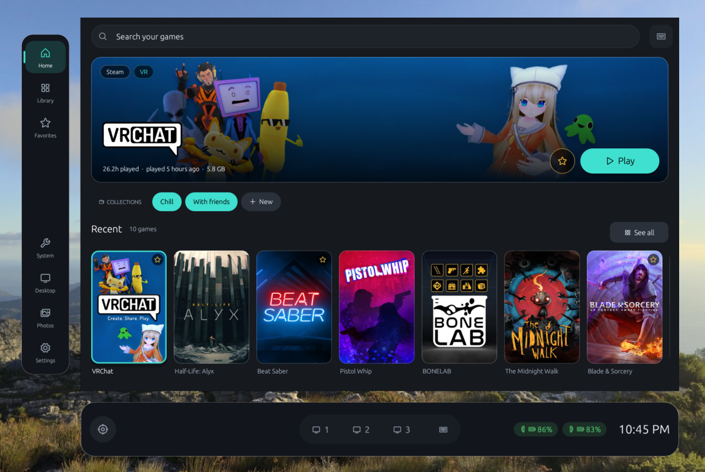
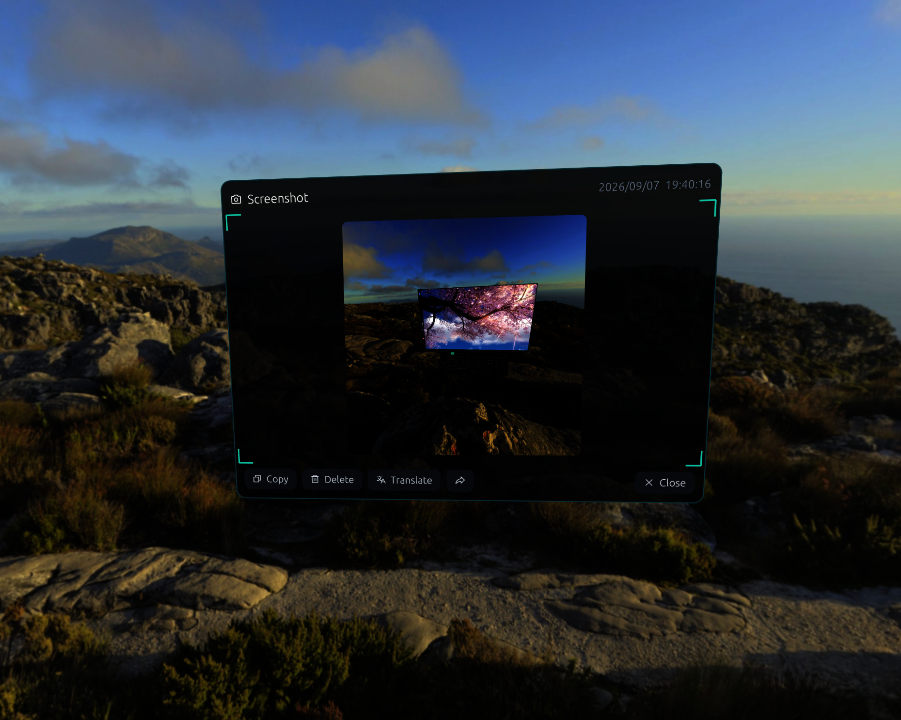
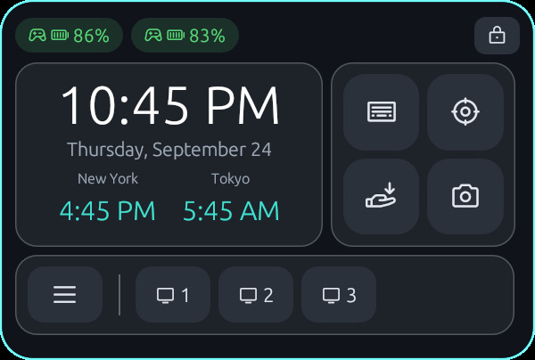
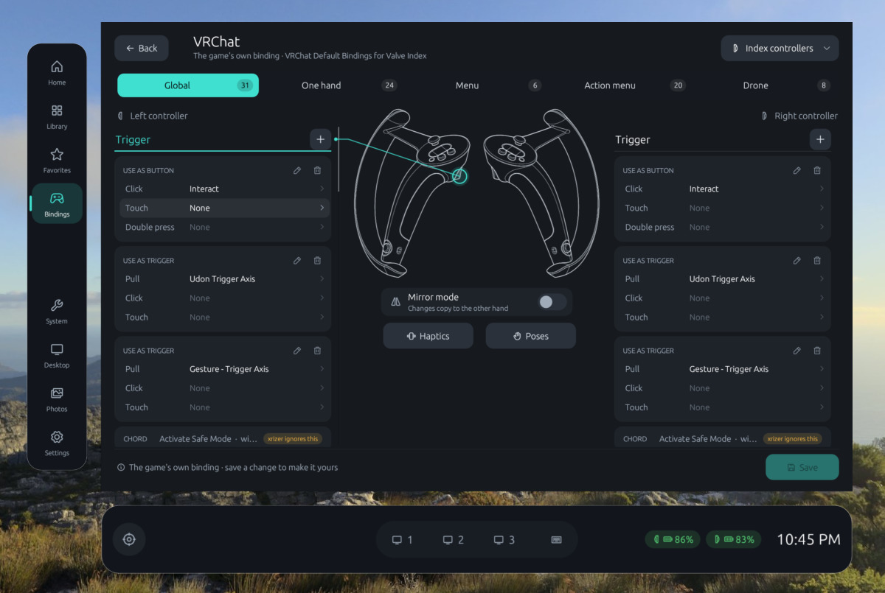
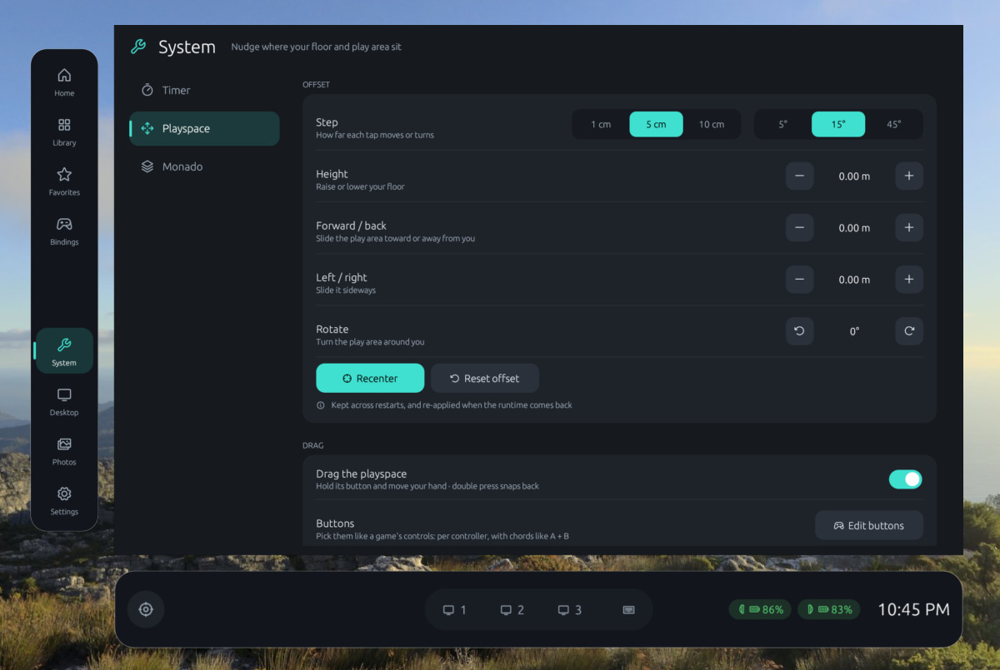
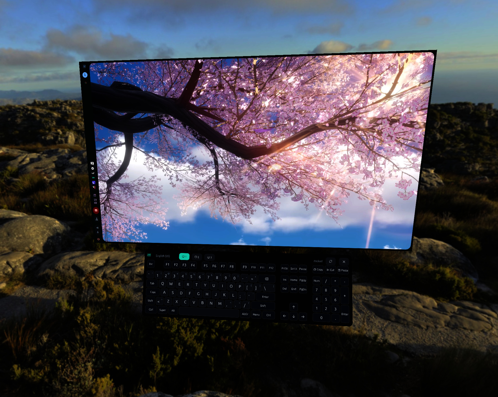

<div align="center">

# 🎮 Monadeck

**A SteamVR-style launcher, dashboard and desktop overlay for Monado and WiVRn on Linux**

Built for a Monado + xrizer workflow.

<table>
<tr>
<td align="center" valign="top"><br><sub>Game library dashboard</sub></td>
<td align="center" valign="top"><br><sub>Desktop screens & keyboard</sub></td>
<td align="center" valign="top"><br><sub>Wrist watch</sub></td>
</tr>
<tr>
<td align="center" valign="top"><br><sub>Controller bindings</sub></td>
<td align="center" valign="top"><br><sub>Playspace tools</sub></td>
<td align="center" valign="top"><br><sub>Desktop control panel</sub></td>
</tr>
</table>

> **AI usage:** This project was developed with AI assistance (Anthropic's Claude), under human direction, testing, and review.

</div>

## What it does

Monadeck is two halves that share one configuration: an in-headset overlay you live in while you're in VR, and a small desktop control panel that looks after your Monado runtime.

- **Launch games from a curved in-headset dashboard.** Steam and non-Steam titles with their artwork, collections and playtime, plus flat Unreal Engine games through [UEVR](https://github.com/praydog/UEVR).
- **Rebind any SteamVR game's controls in the headset.** A SteamVR-style binding editor, in the headset and in the desktop app, that applies while the game runs and also sets Monadeck's own buttons.
- **Bring your desktop into VR.** Your monitors as movable, curved screens with a real mouse and a VR keyboard.
- **A wrist watch that keeps you in the loop.** Clock, batteries, notifications, media controls and quick buttons, on either wrist.
- **Play flat games in VR with your VR controllers.** Gaming mode turns them into an Xbox pad, with per-game remaps to keys and mouse.
- **Let games talk to the overlay.** An OSC listener lets VRChat avatars and tools like VRCOSC drive the watch, dashboard and screens, or raise a notification.
- **Control the runtime without taking the headset off.** Move your play area, pick which app the headset shows, freeze an app's controllers or set a timer.
- **See what's alive at a glance.** Switched-off and out-of-tracking controllers, trackers and gloves grey out, like in SteamVR.
- **See your room the way SteamVR draws it.** Your controllers, trackers, hands and base stations as 3D models around the dashboard, over a floor grid.
- **Draw a boundary around your play area.** Trace it in the headset and its walls fade in as you get close; games learn its size too.
- **Hear VR through your headset.** Its speakers and microphone become the desktop's defaults while VR runs, and the old ones come back when it stops.
- **Look after Lighthouse tracking without opening SteamVR.** Set your floor and play area, pair controllers and trackers, and switch base stations on and off with VR.
- **Set up Monado in one click.** The desktop app installs prebuilt forks of Monado and xrizer, runs the service, and switches runtimes without breaking SteamVR.
- **Or stream to a standalone headset with WiVRn.** Monadeck can run [WiVRn](https://github.com/WiVRn/WiVRn) instead, with PIN pairing and the same overlay.

It deliberately doesn't build Monado from source or manage drivers. For that, [Envision](https://gitlab.com/gabmus/envision) is the right tool; Monadeck can sit next to it.

## Requirements

- **Linux** with a Wayland desktop (the screen mirror uses the desktop portal and PipeWire; KDE is what it's tested on).
- A **Monado**-based OpenXR runtime and **xrizer** for OpenVR games, though not up front: Monadeck can install prebuilt builds of its Monado and xrizer forks for you (Settings → General → *Install built-in*), or use your own. For a standalone headset, install **WiVRn** (26.6 or newer) and choose it as the runtime instead.
- **Steam** (with Proton for Windows games) for your library and cover art. Lighthouse headsets also need **SteamVR** installed: Monado uses its tracking driver, but SteamVR itself never runs.
- Some features need the [Monado fork](https://github.com/Eidenz/Monado): controller freeze, in-headset screenshots, device hotplug, switched-off and out-of-tracking device states, glove batteries, letting go of switched-off controllers, and setting the floor without SteamVR. They hide themselves on stock Monado.

## Install

Grab the `.rpm`, `.deb` or `.AppImage` from the [releases page](https://github.com/Eidenz/monadeck/releases), or build it yourself:

```bash
cd desktop
pnpm install
pnpm tauri build
```

The bundles land in `desktop/src-tauri/target/release/bundle/`. The in-headset overlay is inside the package, so there's nothing else to set up.

On NVIDIA's driver, Monadeck turns off WebKit's DMA-BUF renderer by itself (set `WEBKIT_DISABLE_DMABUF_RENDERER=0` to keep it on). The deck is a fixed-size window, so tiling compositors such as Hyprland, Sway and niri float it on their own.

## Using it

1. Open **Settings → General**. Install the built-in Monado and xrizer, or point Monadeck at your own build prefix and xrizer path (it also tries to autodetect both).
2. **Start the runtime**, then register xrizer/OpenXR. Your existing config is backed up automatically. If Monado lacks `CAP_SYS_NICE`, accept the prompt to apply it.
3. Put the headset on. **Left system button** summons or dismisses the dashboard, **point + trigger** selects, **grip** grabs and moves things.
4. To mirror your desktop, show a screen from the watch or the bottom bar and approve the share dialog once on the desktop; the approval is remembered. The full gesture list lives under **Settings → Controllers** in the headset.

**Artwork tip:** covers that came down as AVIF (some SteamGridDB downloads are, even with a `.png` name) won't decode. Re-save them as PNG/JPEG and hit **Settings → Refresh library**.

## Development

```bash
# Desktop app (the control panel + UI)
cd desktop && pnpm install && pnpm tauri dev

# Overlay on its own (normally the desktop app launches it)
cargo run -p monadeck-overlay
```

A Rust workspace: `crates/core` (runtime orchestration, library and artwork scanning, shared config) and `crates/overlay` (the OpenXR overlay), plus `desktop/`, a Tauri 2 + SvelteKit (Svelte 5) app kept out of the root workspace so its webkit dependencies stay out of the core build. Config lives under `~/.config/monadeck/`.

Optional: `crates/overlay/translate.env` and `picsur.env` (see the `.example` files) bake in a translation endpoint and a Picsur share target for screenshots. The overlay has self-tests for the capture path, keyboard, notifications and text-field focus (`--desktop-selftest`, `--keyboard-selftest`, `--notify-selftest`, `--a11y-selftest`), `--toast-preview [dir]` renders every notification card to PNGs without a headset, and `MONADECK_OVERLAY_FLAT` forces flat panels on runtimes without cylinder layers.

libmonado is loaded through the `wayvr-org/libmonado-rs` pin, which `dlopen`s whatever `libmonado.so` the active runtime points at.

## Credits

[**Monado**](https://gitlab.freedesktop.org/monado/monado) (OpenXR runtime) and [**xrizer**](https://github.com/Supreeeme/xrizer) by Supreeeme (OpenVR on OpenXR); [**WiVRn**](https://github.com/WiVRn/WiVRn) by Guillaume Meunier and Patrick Nicolas (standalone-headset streaming, driven through its D-Bus interface); [**WayVR**](https://github.com/wlx-team/wayvr) by galister and the wlx team, whose desktop overlay, watch and playspace drag this borrows from, plus the [`libmonado-rs`](https://github.com/wayvr-org/libmonado-rs) pin; [**UEVR**](https://github.com/praydog/UEVR) by praydog and the [**chihuahua**](https://github.com/keton/chihuahua) injector by keton, run through [**protontricks**](https://github.com/Matoking/protontricks); [**go-bsb-cams**](https://github.com/Red-M/go-bsb-cams) by Red-M (Beyond eye cameras); [**Envision**](https://gitlab.com/gabmus/envision) for the ground it covered first. Default background: ["Table Mountain 2"](https://polyhaven.com/a/table_mountain_2) by Greg Zaal, Poly Haven (CC0). Icons: [Phosphor](https://phosphoricons.com).

## License

MIT.
